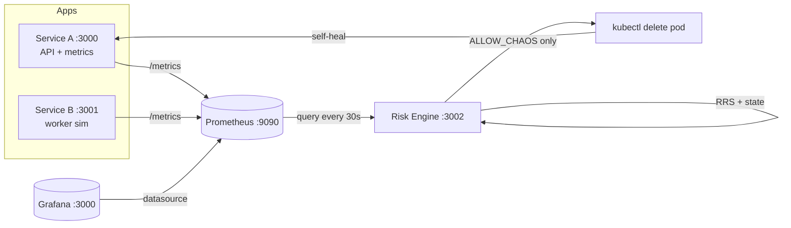
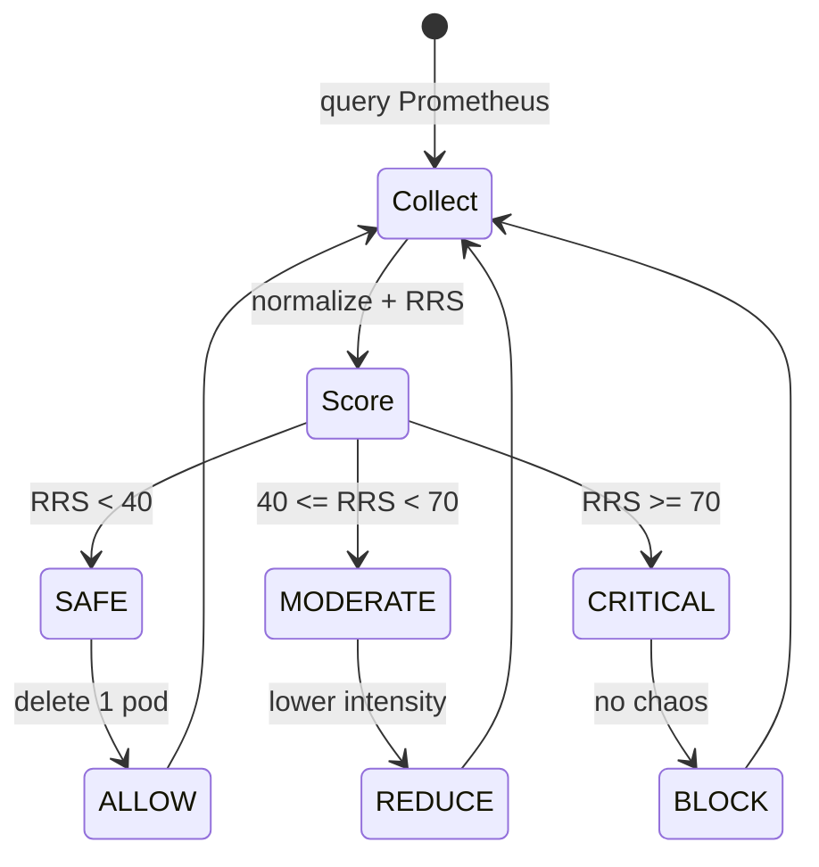

<p align="center">
  
  
  
  
  
</p>

<h1 align="center">Adaptive Risk-Aware Chaos Engineering Framework</h1>

<p align="center">
  <b>Decide before you destroy.</b> A closed-loop controller that measures live risk, then injects
  failure only when the system is healthy enough to tolerate it.
</p>

<p align="center">
  
  
  
  
  
  
  
</p>

---

## What It Is

Most chaos tools inject failure on a schedule and hope the system survives. This framework asks a
smarter question first:

> **"Is the system healthy enough right now to tolerate a fault injection?"**

It watches live metrics, computes a **Resilience Risk Score (RRS)**, classifies the system as
**SAFE / MODERATE / CRITICAL**, and deletes a service pod **only inside a safe window**. Kubernetes
then self-heals. The real contribution is the **explainable decision layer** in front of chaos, not
chaos itself.

---

## Feature Board

| Capability | State | Detail |
|------------|-------|--------|
| Live metrics collection (Prometheus) | SHIPPED | Scrapes both services every 5s |
| RRS scoring (latency, error, CPU, memory) | SHIPPED | Weighted, configurable |
| Three-state decision (SAFE / MODERATE / CRITICAL) | SHIPPED | ALLOW / REDUCE / BLOCK |
| Controlled pod-delete chaos | SHIPPED | Gated by SAFE + cooldown |
| Kubernetes self-healing | SHIPPED | Native Deployment controller |
| Grafana dashboards | SHIPPED | Provisioned datasource |
| Adaptive thresholds | PLANNED | Rolling-baseline anomaly gating |
| Second fault primitive | PLANNED | Network latency / CPU stress |
| Decision persistence | PLANNED | Replay & analysis |
| Automated tests + CI | PLANNED | Unit + integration + audit |

---

## Architecture



## Decision Loop



**Risk formula:** `RRS = 0.35·latency + 0.35·errorRate + 0.20·CPU + 0.10·memory`

---

## Quick Start

Full instructions for Windows and Linux are in **[doc/setup.md](doc/setup.md)**.

```bash
# Linux (summary)
minikube start --driver=docker
eval "$(minikube -p minikube docker-env --shell bash)"
docker build -t adaptive-chaos-service-a:local ./service-a
docker build -t adaptive-chaos-service-b:local ./service-b
docker build -t adaptive-chaos-risk-engine:local ./risk-engine
kubectl apply -f ./k8s/prometheus.yaml ./k8s/grafana.yaml ./k8s/services.yaml ./k8s/deployments.yaml
kubectl port-forward svc/risk-engine 3002:3002 &
curl -sS http://localhost:3002/decision
```

---

## How It Compares to Netflix Chaos Monkey

| Dimension | Netflix Chaos Monkey | This Framework |
|-----------|---------------------|----------------|
| Trigger | Random + schedule | Metric-driven risk gate |
| Risk assessment | None (assumes always-safe) | Yes (RRS + state) |
| Environment | Production | Local prototype |
| Explainability | Low | High (every cycle logged) |
| Goal | Prove constant resilience | Avoid injecting during instability |

We are **not** a replacement for Chaos Monkey. We target the pre-production and educational gap where
blind injection is inappropriate, adding a measurable safety gate and full explainability. See
**[doc/score.md](doc/score.md)** for the full comparison and research framing.

---

## Documentation

| Document | Purpose |
|----------|---------|
| [doc/setup.md](doc/setup.md) | Windows + Linux setup, teardown, troubleshooting |
| [doc/project_timeline.md](doc/project_timeline.md) | Status tracker, flagged bugs, 9/10 impact plan |
| [doc/score.md](doc/score.md) | Idea/current score, research paper strategy, Chaos Monkey analysis |
| [doc/PROJECT_DESCRIPTION.md](doc/PROJECT_DESCRIPTION.md) | Full concept and step-by-step flow |
| [doc/report.md](doc/report.md) | Engineering report and scaling opinion |
| [doc/START_FROM_MINIKUBE.md](doc/START_FROM_MINIKUBE.md) | Linux run guide |
| [doc/chaos-module.md](doc/chaos-module.md) | Manual chaos helper notes |

---

## Project Health

<p align="center">
  
  
  
</p>

The roadmap to 9/10 (fixing the safe-window defect, adding tests, making Service B a real dependency,
and adding a second fault type + persistence) is tracked in
**[doc/project_timeline.md](doc/project_timeline.md)** Section 8.

---

## Security Note

Grafana ships with hardcoded `admin/admin` in `k8s/grafana.yaml`. This is **demo-only**. Never deploy
to a shared or production cluster without replacing credentials and adding auth on the Risk Engine API.
